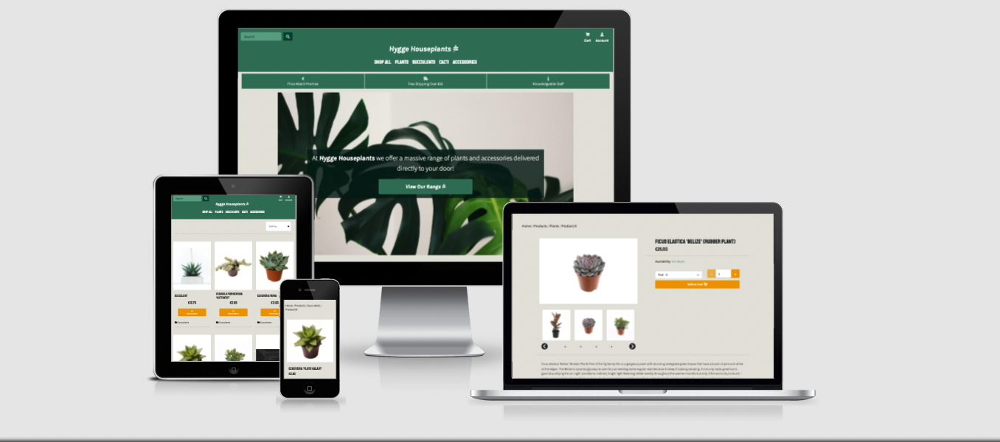

# Hygge Houseplants - An ecommerce site built using the Django Framework

[](https://hygge-houseplants.herokuapp.com/)

[Visit the live site here](https://hygge-houseplants.herokuapp.com/)

### Introduction:
---

Hygge Houseplants is an ecommerce website built to make this mock business's products and services available to site users. The project is a full stack web application built using the Django Framework. The key purpose of the project is to provide additional revenue and online awareness for the business and to allow site administrators to easily update and manage key site areas through the front end site and admin panel. 

*Please note: The business depicted in this project does not exist. The business and all products have been imagined purely as a demonstration for educational purposes.*

## UX Design
---
**This site has been built to cater to two key user groups:**
1. Site Users - These are regular individual, potential customer and collaborators visiting the site to view and buy products and discover information about the business.
1. Site Administrators - These are site owners, and stakeholders, who's primary focus is to manage content on the site, view, edit, create, and delete products, product categories, orders and other data types. While a dedicated admin site exists to enable full administration behaviour for the site, some key business procedures have been made accessible for site admins through the regular consumer facing site, to improve the user experience for site administrators. 

---
### Strategy    
---
**Site Owner Goals**    
*As a site owner/stakeholder I want to:*
- Increase our online awareness and attract new users to our business.
- Increase revenues via direct ecommerce sales.
- Encourage existing customers to revisit the site to make additional purchases.
- Manage products displayed on the site easily.
- Improve my social media engagement.

**Ideal User**  
*The ideal user:*
- Is someone who owns a smartphone, tablet, computer or similar device.
- Will have an interest in plants and other related products.
- Is located in the same country as the business.
- Is comfortable shopping online. 
- Has payment details saved on their device.
- Is english speaking.
- Likes to receive email updates from business's they are interested in.
- Is active on social media.

**User Stories**
*As a new user:*
- I wish to immediately know the site's intention.
- I need to be able to navigate between site pages and sections easily.
- I wish to browse the sites product range.
- I need to view detailed information on particular products of interest.
- I want to purchase products directly through the site.
- I want to be able to create an account to improve my experience for future sessions.
- I want to access the business's social media profiles. 
- I need to be able to contact the business easily.
- I want to register for an account.
*As an existing user:*+
- I need to be able to login to my account.
- I need to view my past orders.
- I need to be able to logout of my account.
*As a site admin:*
- I want to be able to manage site products.
- I want to sort products into relevant groups.
- I need to view, create, edit and delete products.
- I need to view, create, edit and delete categories.
- I need to view, create, edit and delete users.
- I need to view, create, edit and delete orders.
- I need to be able to assign additional site administrators.

---
### Scope
---

The initial scope of the project was to build a fully functioning ecommerce site for his imagined business. Site users must have the means to browse and view products, add products to their cart and checkout successfully.

The second core goal for this project was to enable site administrators to have to key functionalities to view, add, edit and delete products and other site content.

for future development phases of this project, the main focus will be to add additional functionality for returning users and creating an admin panel where site admins can update site infiramtion in bulk.

---
### Structure
---

The structure of the current project is as follows. 

The project is conmposed of the following applications. Each application is designed to sepparate concerns of specific functionality.

**Apps:**
- Index
- Products
- Cart
- Checkout
- Contact
- Profile
- Social

Django-allauth is used to provide standard user account functionality such as login, logout, register, confirm email, forgot password etc....

**Pages**
Index Page - This is the primary landing page

Products Page - View of all products with search options to narrow donw search.

Single Product Page - A detailed view of a single product with an add to cart form and Edit and delete links for super users.

Add Product page - This is an admin only page which contains a form where a new product can be added. There are two outcomes for this page.
    1. If the product has no variants, the product is created and the creator is directed to the detailed product page on completion.
    1. If the wproduct has variants, the user is taken to the add variants page on completion.

Add Variant page - On this page a site admin can create, edit or delete product variants. On completion of this page, the user is brought to the single product view of 
the base product.

Cart Page - This page displays the items that a user has added to their cart. There are two options, a user can then checkout using the button or go back to products using the alternate button.

Checkout page - This page has two sections, a order summary section and a checkout area which enables the user to enter their details, pay and complete their order.

Checkout success page - On successful checkout a user is brought to a success page which displays a concise summary of their order.

Contact Page - The contact form is a generic contact form which enables users to send a message to the business. On successful completion a success message is displayed.


---
### Skeleton
---

---
### Surface
---

**Fonts**
1.  --hygge:  'Karla', sans-serif -> This is the Logo font.
1.  --main: 'Source Sans Pro', sans-serif -> This font is used for the body text, larger passages of text and with heavier font weight it is also used for form labels and lesser headings.
1.  --head: 'Staatliches', cursive; - This is used as the main Headin font. It's uppercase font style and bold font-weight is bold and striking and draws attention to key section headinds, alerts and other sections of informations that site users need to be made aware of.

**Colors**
A predominently green color palette was chosen for this project to allude to the site's main content (Plants). Three shades of green (light, mid, dark) are the basis of the color palette. 
These are offset with bright orange accent color used for buttons, links and other interactive elements. Bootstraps default green (success) and red (danger) color's are utilised in "yes"/"no", "do"/"don't" scenarios, where users are given multiple decisions or when feedback to a user input with a positive or negative connotation is provided. In such instances the traffic light (green means go, red means stop) metaphor is chosen rather than adhering to the color scheme in order to provide a better user experience and improved first-time-learning. 

**Images**

**Icons**

---
### Technologies Used:
---
#### Languages 
* Html5
* CSS3
* Javascript
* jQuery
* Python

#### Libraries & Frameworks 
* Bootstrap
* Django - Used for authentication, routing, serving dynamic html templates and interacting with the database.

#### Other 
* Fontawesome - Used to add icons throughout the project.
* Google Fonts - Used to enable the use of additional fonts for the project.
* Balsamiq - Used to create Wireframes for the purpose of mocking up the project.
* Heroku - For app hosting and deployment.
* Stripe - To enable customer payments for the project.
* Amazon AWS S3 - Used to host images, files and other documents.
* Postgress - Used to store site data.

---
### Credits
---
#### Image Credits

* [Index.html Hero Image](https://unsplash.com/photos/yb3hsmz4utg)
credit Chris Lee from [Unsplash](https://unsplash.com/)

* [Plant Category Tile Image](https://unsplash.com/photos/FV_PxCqgtwc)
credit Igor Son from [Unsplash](https://unsplash.com/)

* [Succulent Category Tile Image](https://unsplash.com/photos/tcgMBsW4zlU)
credit Kari Shea from [Unsplash](https://unsplash.com/)

* [Cactus Category Tile Image](https://unsplash.com/photos/wDhLrN9FAAM)
credit Stephanie Harvey from [Unsplash](https://unsplash.com/)

* [Accessories Category Tile Image](https://unsplash.com/photos/NLcLjLNUJbY)
credit Tom Crew from [Unsplash](https://unsplash.com/)

* [Hygge Plaque image](https://unsplash.com/photos/SDxDQXixgfU)
credit Julian Hochgesang from [Unsplash](https://unsplash.com/)

#### Code Credits

* Contact form Tutorial - To add a contact form functionality to the project, I used a guide from this
[learndjango.com tutorial](https://learndjango.com/tutorials/django-email-contact-form)

* Custom image upload button and styles were utilised as shown in the Code institutue boutique ado code along project   
[Widgets.py](https://github.com/Code-Institute-Solutions/boutique_ado_v1/blob/master/products/widgets.py)   
[Template used](https://github.com/Code-Institute-Solutions/boutique_ado_v1/blob/master/products/templates/products/custom_widget_templates/custom_clearable_file_input.html)   
[The CSS below was sourced from this link](https://github.com/Code-Institute-Solutions/boutique_ado_v1/blob/master/static/css/base.css)  

    ```
    .btn-file {  
    position: relative; 
    overflow: hidden;   
    }

    .btn-file input[type="file"] {
        position: absolute; 
        top: 0; 
        right: 0;   
        min-width: 100%;    
        min-height: 100%;   
        opacity: 0; 
        cursor: pointer;    
    }   

    .custom-checkbox .custom-control-label::before {    
        border-radius: 0;   
        border-color: #dc3545;  
    }   

    .custom-checkbox .custom-control-input:checked~.custom-control-label::before {  
        background-color: #dc3545;  
        border-color: #dc3545;  
        border-radius: 0;   
    }
    ```

* jQuery UI slideToggle easing easeOutBounce - to create a more engaging user experience for the index page Hygge section, jQuery's .slideToggle() method was used.
  I was made aware of the additional slideToggle easing effects at [this stackOverflow post](https://stackoverflow.com/questions/6121255/toggle-div-with-easing) from contributor Sylvain.

* Add image preview when image is added to add product form - to provide user feedback when an image is uploaded, I used a custom javascript script to render a small thumbnail image preview of the uploaded image. The core functionality of this script was inspired from [this stack overflow post](https://stackoverflow.com/questions/22245100/how-to-display-an-image-from-a-file-input) from Nephelococcygia.

    ```
    function myFunction() {
        var file = document.getElementById('file').files[0];
        var reader  = new FileReader();
        // it's onload event and you forgot (parameters)
        reader.onload = function(e)  {
            var image = document.createElement("img");
            // the result image data
            image.src = e.target.result;
            document.body.appendChild(image);
        }
        // you have to declare the file loading
        reader.readAsDataURL(file);
    }
    ```

* To load existing product variants I used the queryset arguement [as outlined in the Django documentation](https://docs.djangoproject.com/en/dev/topics/forms/modelforms/#changing-the-queryset)

* To disable the product form when editing product variants I used the technique of wrapping the form fields in a fieldset and assigning that fieldset with the ```disabled="disabled"```
attribute. This techniques was found in [this stackoverflow post](https://stackoverflow.com/questions/3507958/how-can-i-make-an-entire-html-form-readonly)

* Center text in ```<input type="number">``` I used information found in [stackoverflow post](https://stackoverflow.com/questions/23715881/center-text-in-html-number-input) to control the appearance of
the default number input adjust buttons and to center the text.

    ```
    input[type='number']::-webkit-inner-spin-button, 
    input[type='number']::-webkit-outer-spin-button { 
        -webkit-appearance: none;
        margin: 0;
    }
    ```

* To enable a 'not-allowed' cursor on a disabled button I used ``` cursor-events: all !important ``` to override a bootstrap error preventing this desired behaviour. I was made aware of this fix from [this stackoverflow post](https://stackoverflow.com/questions/50349017/how-can-i-change-cursor-for-disabled-button-or-a-in-bootstrap-4)


* To prevent form submission on enter I recycled some code that I used in my MS3 project:
    ```
    $(document).ready(function() {
        $(window).keydown(function(event){
            if(event.keyCode == 13) {
                event.preventDefault();
                return false;
            }
        });
    });
    ```
    This code was originally sourced from [this stackoverflow post](https://stackoverflow.com/questions/895171/prevent-users-from-submitting-a-form-by-hitting-enter).

* To add padding to the default select menu caret I hid the default caret and displayed an svg image instead. This method was described by 'kilinkis' in [this stackoverflow post](https://stackoverflow.com/questions/62576942/css-webkit-appearance-menulist-dropdown-select-tag-how-to-give-padding-to) and was edited to position the caret further towards the center of the select field. The caret Icon SVG was sourced from [fontawesome.com](https://fontawesome.com/v5.15/icons/caret-down?style=solid) | [license for use here.](https://fontawesome.com/license/free)

    ```
    select {
      appearance: none;
      background-color: transparent;
      background-image: url(arrow.svg);
      background-repeat: no-repeat;
      background-position: right;
      background-size: 30px;
    }
    ```
* To render each collection product as an individual option, each product was rendered as a checkbox to provide a better user experience thant the default django multi-choice dropdown field. To enable this functionality 'forms.CheckboxSelectMultiple' was used. This technique was learned from [this medium.com blog post](https://medium.com/swlh/django-forms-for-many-to-many-fields-d977dec4b024). The code snippet used can be seen below:

    ```  
    members = forms.ModelMultipleChoiceField(
        queryset=Member.objects.all(),
        widget=forms.CheckboxSelectMultiple
    )
    ```

* To create a more user friendly order number I used ```.hex[:6]``` when creating the uuid to limit it to 6 charachters. I then added a prefix to make order numbers more consistent. 
I discovered the ability to limit UUID in [this stack overflow post](https://stackoverflow.com/questions/26030811/generate-a-unique-string-in-python-django/26032898)

---
### Code
---

#### Bugs Fixed:
* Variant delete functionality not operating as anticipated. When creating the delete variant functionality [djangos in built can_delete method](https://docs.djangoproject.com/en/3.2/topics/forms/formsets/#can_delete) was used. When the form was submitted, products were not being deleted. Using print statements it was determined that while the variant was being deleted, it was then subsequently being recreated with the same id when, the save() method was called on each form in the formset. To fix this bug the variant delete functionality was called after the form was saved to ensure that the variant is not recreated. 

* When trying to remove Products with variants from the cart. The variant id attribute is extracted from a unique item_id, this variant id is the key for each variant object in the cart session variable. 

eg. ```
    {product_id: {'product_variants': {variant_id: item_quantity}}}
    ```

When taking trying this initially I was experiencing an issue where the product variant was not being removed from the cart. To debug this I checked if the variant_id was a string, it returned True each time. I then checked if the variant was None with a if statement and I added a secondary print statement to check the value of the variant_id variable again. I found that it was returning as an int, which meant that when I tried to delete the variant object from the cart dictionary it was looking for an index of the dictionary that didn't exist instead of calling a dictionary key. To remedy this I explicitly converted the variant_id variable to a string so that the correct dictionary key is selected when the del keyword is used. 

See code below:

``` try:
        product_id = None
        variant_id = None

        if "-" in item_id:
            product_id = item_id.split('-')[0]
            variant_id = request.POST.get('variant')

            print(isinstance(product_id, str))
            print(isinstance(variant_id, str))
        else:
            product_id = item_id

        cart = request.session.get('cart', {})

        if variant_id:
            print(variant_id)
            print(type(variant_id))
            del cart[product_id]['product_variants'][str(variant_id)]
```

***

### Deployment 


To replicate this project in your own local environment, the following steps should be followed:
 1. Go to the [project repository on Github](https://github.com/nickassafkirk/hygge_houseplants)

 1.  Within the code section if using the Gitpod IDE, first install [Gitpod's browser extension](https://www.gitpod.io/docs/browser-extension/), then with the extension installed click the green gitpod button to create a clone of this project in your own Gitpod IDE. 
 
 1. If using the a different development environment this project can be cloned to your local machine using HTTPS or SSH - Detailed instructions on how to do this can be found in [Github's documentation](https://docs.github.com/en/github/creating-cloning-and-archiving-repositories/cloning-a-repository-from-github/cloning-a-repository)

 1. With the project repositiory cloned to your machine you will then need to create and env.py file in your root directory. If it is not already there you must then create a .gitignore file and add your env.py file to it.

 1. In your env.py file first ```import os``` you will create your environmental variables using the statement ```os.environ.setdefault('VARIABLE_NAME', 'variable_value')```

    For this project the following env variables should be created.
    * 'SECRET_KEY' - Your Django secret key token: To create a secret key [this secret key generator can be used](https://miniwebtool.com/django-secret-key-generator/)
    * 'DEFAULT_FROM_EMAIL' - The default from email used for emails sent from the application
    * 'DATABASE_URL' - The postgress database URL created when Postgress was installed in your Heroku app
    * 'HEROKU_HOSTNAME' - The URL for your deployed heroku app eg. your_project_name.herokuapp.com
    * 'EMAIL_HOST_PASS'
    * 'EMAIL_HOST_USER'

    The following env variables should be added to the config vars in your Heroku app but can be added to you local env for development purposes. 

    * 'AWS_ACCESS_KEY_ID'
    * 'AWS_S3_REGION_NAME'
    * 'AWS_SECRET_ACCESS_KEY'
    * 'AWS_STORAGE_BUCKET_NAME'
    * 'STRIPE_PUBLIC_KEY'
    * 'STRIPE_SECRET_KEY'
    * 'STRIPE_WH_SECRET'
    * 'USE_AWS' - Set to True
    
1. With the Environmental variables defined we now need to install the packages needed to run the project. These can be found in the requirements.txt file in the root directory. We can install each dependency by using the ```pip3 install <package_name>``` command in the terminal.
    * pip3 install boto3
    * pip3 install django
    * pip3 install django-allauth
    * pip3 install django-crispy-forms
    * pip3 install dj-database-url
    * pip3 install django-storages
    * pip3 install gunicorn
    * pip3 install pillow
    * pip3 install psycopg2-binary

1. If the requirements.txt file does not exist in your workspace, you can create it by using the ```pip3 freeze > requirements.txt``` command in the terminal or by installing the packages outlined [here](https://github.com/nickassafkirk/hygge_houseplants/blob/main/requirements.txt)     
*Please note: The package versions listed in the requirements.txt file above were accurate at the time this project was created. New iterations of these dependecies may have been released at the time that you wish to clone this project - You can consult each package's documentation should you require additonal information.*

    *Also note: Each package installed may be composed of more than one component, please check what dependencies are installed with the command* ```pip3 freeze``` *after each package has been installed.*

1. At this point you need to create a Procfile if it does not already exist. To do this you can use the command ```touch Procfile``` in the terminal. Once created you can write the following code in the Procfile: ```web: gunicorn <project_name>.wsgi:application``` with the name of the project where ```<project_name>``` has been include in the command above.

1. Were now ready to create our app in Heroku. To do so go to [heroku.com](https://www.heroku.com) and create an account or login by following the prompts.

    Next, in your account panel click the 'new' dropdown button in the top right corner. From the options select the 'Create new app' option. This will bring you to the following page.

    

    Here you can select a name for you application and select your nearest geographical region. In my case Europe.

1. You will no be brought to the main panel for your new app. In the resources tab search for postgres in the add-ons search box. Select Heroku Postgres. YOu can select the Hobby Dev option tier. 

    

1. Once we've added the Heroku Postgres Add-on we can go to the settings tab in the panel. Next click 'reveal config vars'. After adding the Heroku Postgres add-on your DATABASE_URL variable should have been automatically created in heroku. 
You can now create the Environmental variables you have already included in your env.py file in the config vars section in heroku.

1. We then need to connect to the postgres DB in the settings.py file in our base app so we can make migrations. We can do this by commenting out the following code in the settings.py file and by temporarily adding the DATABAE_URL variable and value to the envy.py file in our root folder.

    ```
        DATABASES = {
            'default': {
                'ENGINE': 'django.db.backends.sqlite3',
                'NAME': BASE_DIR / 'db.sqlite3',
            }
        }
    ```
    You can then run the ```python3 manage.py makemigrations``` command, followed by ```python3 manage.py migrate``` if no errors are returned.

1. You can now create a superuser for your Postgres DB by using the command ```python3 manage.py create superuser``` in the terminal and following the prompts to add a username, email and password. Once this is created and your app is deployed this will enable you to sign into the /admin panel for your deployed project.

1. You can then uncomment the code above and delete the 'DATABASE_URL' variable from the env.py file which will ensure that the postgress DB is used on the deployed herokuapp and the default SQLlite DB is used during development.

1. Next we need to Configure AWS S3: first go to [Amazon AWS](https://aws.amazon.com/) and sign in or sign up by following the prompts. You will need to provide credit card details to successfully create an account but it is unlikely that you will incur any charges. You can read Amazon's terms and conditions for further information on Billing, Privacy and more. 

1. Once you've created and verified your account, navigate to AWS S3 using the search bar or services menu at the top of the page. Next click create bucket.
Assign your bucket name and pick your closest region. You can then scroll past all other options and click save. 

1. In the menu within your newly created bucket, click the properties tab. Then scroll to the static website hosting section and click edit. Here click the host website checkbox and enter index.html and error.html in the suggested fields. After that click save. While the two specified pages are irrelevant, this will create a URL that we can use to access our static and media files.

1. Next in the permissions tab in the bucket panel, go to the CORS section, click edit and paste in the following code: 
    ```
    [
        {
            "AllowedHeaders": [
                "Authorization"
            ],
            "AllowedMethods": [
                "GET"
            ],
            "AllowedOrigins": [
                "*"
            ],
            "ExposeHeaders": []
        }
    ]
    ```

1.  In the permission again, in the "Block public access (bucket settings)" section click edit and unblock all the options and click save changes. You may be required to confirm your decision by typing confirm.

1. In the permissions tab go to edit permissions, first copy (ctrl/cmd + c) the 'Bucket ARN' and then click the policy generator tab. In the policy generator select policy type of 'S3 Bucket Policy', effect can be left as the default allow, in the principal we can use the * symbol. In the action dropdown menu select 'Get Object' and then in the ARN field paste the ARN value you copied from the previous page. Next click 'add statement' and finally the 'add policy' button. The completed policy will then be revealed. Copy this completed policy and paste it into the policy field on the edit policy page. Finally within the pasted policy add /* to the end of the resource key to enable access to all resources in the bucket.

1. Finally in the Permissions section again, navigate to the access control list section. In the public access section, click edit and then beside the 'Everyone (public access)' subheading click the 'list' checkbox and click save.

1. Next configure IAM. In the AWS services menu Search for IAM. Once in IAM, in the dashboard on the left hand side click the user groups tab. Click the create user group button and and give your new group a name in the relevant field. Skip the next page sections and click the button to create your user group. 

1. On dashboard on the left hand side you now click the 'policies tab. Now click the blue create policy button. This will open a popup. Click the JSON tab and then the link in the top right corner of the popup that says 'Import managed policy'. Using the search bar select the 'Amazon S3 full access' option and click import. This will load some Json into a textfield. We're going to change the value of the 'resource' key to a list. the first list item will be the S3 Bucket ARN that we used when configuring our s3 bucket, the second list item will be the S3 Bucket ARN followed by '/*'

    eg: 
    ``` 
        'resource': [
            'enter the s3 arn here',
            'enter the s3 arn here/*',
        ]
        
    ```
    now click the 'next tags' button, and after that skip the tag options and click the 'next review' button. On the review page you can give the policy a name and a description and click create policy. This will bring you back to the policies page where you should now see your new policy listed.

1. Now in the dashboard on the left click into the user groups section. Access the group you created in step 22. In the permissions tab, click the 'add permissions menu in the right hand corner of the permissions panel. The click the 'attach policies' link. From the list of available policies find the policy we just created adn then click the attach permissions button to attach it to our user group. 

1. We now need to create a user. In the left hand panel click 'users', then click the 'create users' button. Add a user name in the relevant field eg projectname-staticfiles-user. Select the 'programmatic access' checkbox and then click the 'next permissions' button. we'll be taken to a page where our different user groups are listed. Selected the user group that we created in the provious steps and then click 'next; tags'. We can skip the add tags section and click the 'review' button. Finally having reviewed the user we just created we can click the create user button. 

1. You will land on a success page where your user, user_access_key_id and user_secret_key are listed. Download the user security details using the download csv button and save the file somewhere secure. It's important to download the file as you wont be able to access them again.

1. You now need to connect your Django app to our S3 Bucket. In settings.py, first ensure that 'storages' is added to you our list of installed apps. Then ensure the following code is included in the settings.py file under the static/media comment/ 
    ```
    if 'USE_AWS' in os.environ:
        AWS_STORAGE_BUCKET_NAME = os.environ.get('AWS_STORAGE_BUCKET_NAME')
        AWS_S3_REGION_NAME = os.environ.get('AWS_S3_REGION_NAME')
        AWS_ACCESS_KEY_ID = os.environ.get('AWS_ACCESS_KEY_ID')
        AWS_SECRET_ACCESS_KEY = os.environ.get('AWS_SECRET_ACCESS_KEY')
        AWS_S3_CUSTOM_DOMAIN = f'{AWS_STORAGE_BUCKET_NAME}.s3.amazonaws.com'
    ```

1. In heroku under the settings section reveal your config vars and use the values from S3 Bucket and the CSV file that you downloaded at step 26 to add the config variables to your heroku app. You will also need to Add the following variables

    AWS_STORAGE_BUCKET_NAME -> The name of your S3 Bucket you created for this project
    AWS_S3_REGION_NAME -> The region for your S3 Bucket eg 'eu-west-1'
    AWS_ACCESS_KEY_ID -> The AWS access key ID from the CSV file you downloaded
    AWS_SECRET_ACCESS_KEY -> The AWS secret access key from the CSV file you downloaded
    USE_AWS -> True

1. You can then delete the DISABLE_COLLECTSTATIC config variable from your heroku app to allow heroku to collect static files and upload them to S3


