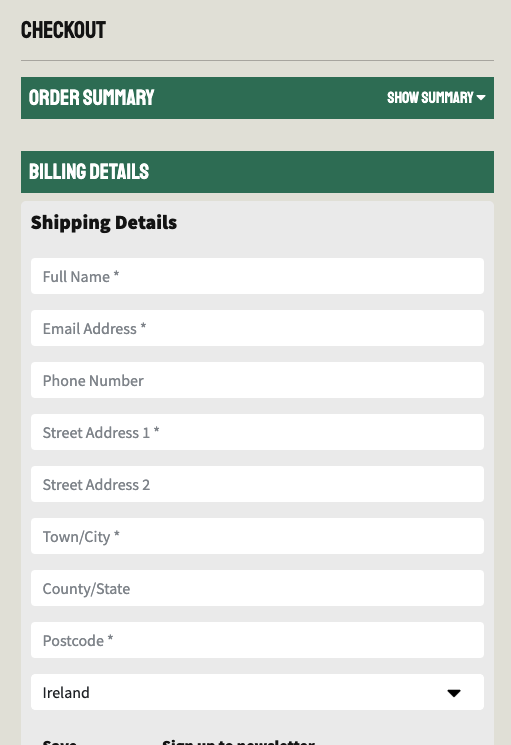

# Testing

Other documentation for this project can me found in the accompanying [README.md file](https://github.com/nickassafkirk/hygge_houseplants/blob/main/README.md)


Upon completion of the product and throughout it's development, each site page was tested thoroughly to ensure that responsive design was implemented, that site functionality performed as intended and overall the site provides a good user experience.


## User story Testing
---

**User Stories**
*As a new user:*
- I wish to immediately know the site's intention. &check;
- I need to be able to navigate between site pages and sections easily. &check;
- I wish to browse the sites product range. &check;
- I need to view detailed information on particular products of interest. &check;
- I want to purchase products directly through the site. &check;
- I want to be able to create an account to improve my experience for future sessions. &check;
- I need to be able to contact the business easily. &check;

*As an existing user:*+
- I need to be able to login to my account. &check;
- I need to view my past orders. &check;
- I need to be able to logout of my account. &check;

*As a site admin:*
- I want to be able to manage site products. &check;
- I want to sort products into relevant groups.
- I need to view, create, edit and delete products. &check;
- I need to view, create, edit and delete categories. - *Admin Site functionality*
- I need to view, create, edit and delete users. - *Admin Site functionality*
- I need to view, create, edit and delete orders. - *Admin Site functionality*
- I need to be able to assign additional site administrators. - *Admin Site functionality*

1. #### *As a new user:* I wish to immediately know the site's intention.

    Upon landing on the homepage a large logo is apparent, the presence of the work 'plant' and the use of a leaf icon suggest that the page is plant/flower related. Looking at the main navigation links on desktop the categories plants, succulents, cacti and accessories suggest that the subject matter of the site is plant related. The link for shop all, cart, in the site header suggest that products are sold on thsi site. Scrolling down a large hero image with a picture of a plant is immediately apparent. The overlaying text describes the business's purpose. As a new user I understand that this site sells plants and related products. Haveing tested this experience I am satisfied that the user story has been satisfied. 

1. #### *As a user:* I need to be able to navigate between site pages and sections easily.

    Upon landing on the page on desktop 5 dominant links are visible in the main menu. Clicking each link brings me to the expected page where I can find related image. At the top of the page the logo can be clicked to return to home. On mobile devices an obvious burger stack icon button is visible. Clicking this reveals the same main links, clicking each link transports me to the expected page. On the homepage clicking the "view our range button" on the hero image transports me to the products page as expected.
    Clicking each of the category tiles takes me to the expected product category.
    In the footer the same links are visible clicking each link takes me to the expected page. With the exception of the Blog link and About link which refresh the current page. 
    On other site pages navigation is also predictable and self explanatory. Buttons and button like objects are apparent, clearly labelled and change color on action or hover. Similarly links stand out on the page and images are also often clickable as anticiapted. Overall having used the site I am satisfied that it is easy to navigate between site sections and the behavour demonstrated is as expected.

    **Known Issue** As outlined above, the Blog and About footer links do currently not link to any page. Unfortunately it was not in the scope of the current project to complete these pages but the decision has been made to leave the links present n order demonstrate their position for future development cycles of this project.

1. #### *As a user:* I wish to browse the sites product range,
   #### *As a user:* I need to view detailed information on particular products of interest:

    From all pages the sites products can be accessed from the 5 links in the main navigation menu and the product links present in the footer.
    From the homepage the products can be accessed from the button overlay on the hero banner and via the category tiles on the index page. Products can also be found by using the search bar in the site header. 

    Once on [the products page](https://hygge-houseplants.herokuapp.com/products/) each product is clearly visible. Each products key information such as it's image, name, price and category can be seen. 

    A sort menu on the top of the product page allows me to sort products my my selected criteria. Clicking the view product button or the product image transports me to a detailed page with more information on the produuct of interest. On this page 
    More images are available if the product has options. Product options are selectable using the attached dropdown. Selecting a product option changes the image and price if it differs from the previous product variant. A product description is also visbile which provides detailed info on the product. 
    Towards the top of the page links split by a "/" charachter show me the path to the product I'm viewing. To go back I can use these breadcrumb links or the main navigation buttons in the header or footer. 
    Having tested the site I am satisfied that the site fulfils the user story. 

1. #### *As a new user:* I want to purchase products directly through the site:
    On the detailed product page a clear add to cart form is visible. It uses bright colors and is immediately noticeable. A bold add to cart button tells me that I can add a product to the cart. Plus and minus buttons adjust the quantity showing me that I can add multiple quanities of a product to the cart. The buttons will not allow me to add more than the quantity displayed for a product to the cart. If a product has options I can select each option from the included dropdown menu.
    If the variant I have selected is a different price, the price updates as well. 
    After clicking the add to cart button, a message pops up notifying me that my item has been added to the cart. In the top right of the site a cart icon is visible. Clicking this icon brings me to a page where I can see that the item/s I added are present. Updating the quantity of a product in my basket and clicking upddate, updates the quantity accordingly. Clicking the delete button removes it from the cart. If I remove all the items from my cart a link to view more products is displayed.
    The cart total, product count, shipping amount and tax information are displayed. 
    A bright checkout button prompts me to continue to checkout. Clicking this button takes me to a page where a more concise summary of my cart is included. Here I can check that the items I want are what are in my order. Next a form allows me to fill out my personal details and shipping information. The form has a * character beside fields that are mandatory. If I forget to fill out a mandatory field the form will not submit and a message is shown. 
    A credit card input box is displayed. If I input an incorrect card a red error message is shown. If I input correct card details a loading spinner loads which shows me that my action has been received and my order is being processed.
    After a few moments a success message appears and I'm directed to a confimration page with a summary of my order. It also notifies me that an email has been sent to my address. From this experience I am satisfied that I can order products through the site and that the user story is satisfied. A link to my account or to products then allows me to navigate to more site sections.


1. #### *As a new user:* I want to be able to create an account to improve my experience for future sessions,
   #### *As an existing user:* I need to be able to login to my account,
   #### *As an existing user:* I need to view my past orders:


    As a nfirst time visitor I can see an account menu option in the header of every page. Clicking in this reveals a sign up and sign in option. If i go to the sign up link, it takes me to a page where I can enter my details and create an account. To test his I used a [temporary mail service](https://temp-mail.org/en/) and entered my details. When clicking th sign up button I receive a message informing me that an email has been sent to my email. Checking my temporary email I can see that an email has been received. clicking the enclosed link brings me to a confirmation page when I can verify my email. Once I have clicked the verify email link, I am able to sign in using the username and password I just created. When I click the account button now I can see there is a link to my account.
    Clicking this link brings me to an account where I am greeted by my username. There's a form where I can fill out my details and area that says order history which is currently blank.
    If I fill out the form details and submit it, I can see that my details have been saved. If I re-fill out the form and change some details I receive an updaqte message and can see that my chenges have been saved. 

    By adding some items to my cart and going to the checkout page. My details are not entered into the form. This was not the expected behaviour. Once I have successfully completed my order I can see a link to my account on the confirmation page. Clicking this link brings me back to my accoutn where I can now see me order in the order history section. This is the expected behaviour. If I logout and log back in, I can see that my order history and personal details are retained. clicking an order number brings me to the order confirmation page for that order. Overall I am happy with this experience and believe that this user story is mainly satisfied although it would be preferable if my details were automatically added to the form on checkout.

    **Known Issue** As outlined above, the user details do not update when the save details selection is made on check, nor are they automatically enterred into the shipping details section of the checkout page. While this was the intended behaviour it was not possible to complete this functionality within the project deadline. However the save details, allow-marketing and message for seller form field and checkboxes have been retained for demonstration purposes and to allow these functionalities to be added going forward.

    
1. #### I need to be able to contact the business easily.
    In the footer of every page a "contact link exists". Clicking this link brings me to a page with a clearly displayed contact form. Mandatory fields are labelled with a '*' charachter and I am prevented from submitting the form if I have forgotten or incorrectly enterred a mandatory field. After successfully filling out the form and clicking submit, I receive a success message to say that my email has been received and to expect a response.
    Below the contact form there are also links to the business's social media where I can make contact through their various social media accounts.
    As a site user I am satisfied that I can easily contact the business.
    
    *Having tested this I can also confirm that emails sent through the contact form are received to the elected admin address for this project. Thus confirming that email handling is operated as intended*

   
1. #### **As a site admin I want to be able to manage site products:**
    A. Adding new products - When logged in as a site superuser by clicking the account link in the header, an add products link is available. Clicking this link brings the user to a add product form. By filling out the form, a new product can be added. Required fields are noted with an asterisks on their label. The image box has been styled to allow easy drag and drop or selection of local files from the user's machine. When an image has been uploaded, a preview of the image is displayed.
    Clicking the X icon on the image thumnail deletes it. Uploading a new image, overides the existing image. This is expected behaviour.

    If the 'Has variants" checkbox is left blank, clicking the create product button will submit the form, display a success message and bring the user to the detailed product page. This shows that new products can be created by site admins.
    
    If the user wants to create a product which has variants, upon clicking the "has variants" checkbox the form submit button text will change to indicate that an additional step will occur upon save. Upon submission the user will be redirected to the add_variant page where the product form that has just been filled out is displayed with it's fields disabled. Below the inactive product form a new field for a variant is available to be filled out. Each variant has a size and color, field, a quantity, price, sku and image field. Mandatory fields are noted with a * charachter. Either size or color is required for successful submission. If both size and color are left blank the form will fail validation and user will return to the page with an error message displayed. Upon successful completion a user will brought to the detailed product page where the variant is displayed.

    From this testing I am satified that a user can create a new product to be displayed on the site. 

    B. Editing existing products - When a site admin is viewing the site an edit and delete link will be visible below each product preview card on the products page or beneath the add to cart form on the detailed product page. Clicking the edit button brings the user to a form identical to the add product page but with the fields filled out with the current product data. Editing the field and updating will succeffully update the product details. If a mandatory field is left blank, the from will not allow submission. 
    If the product has variants the has variants button will be selected. If the form is submitted with the has variants button selected, the user will be bought to the add variants page where the user can edit existing variants and add a new one.

    If the product has variants and the "has variants" checkbox is unchecked when the form is submitted the product will be displayed without it's variants. However the variants will not be deleted they just wont be displayed. If the product is edited again and it's has variants checkbox is selected, the variants will be restored and displayed again.
    
    From this testing I am satisfied that a admin user can conveniently edit products.

    C. Editing variants. Editing variants is only accessible via the edit product link. Once the base product form has been completed or left unchanged, once the form is submitted with the "has variants" checkbox checked, the user will be brought to the add_variant page. This pages uses django's model formsets which facilitate edit, creation and deletion of multiple similar forms in a single request. If a product has variants each variant formset will be loaded with it's exisitng values entered. Changing any of these values will upate the variant and save it's new values. It was experienced that clicking any of the update variant buttons would submit and update all changes made to all variants not just the one who's form button was clicked. While this isn't completely expected behaviour, it is quickly learned and is acceptable for a admin task. It was also experienced that only one additonal new variant could be added in a single request which again could be improved in future development cycles by enabling functionality upload multiple new variants in a single request. Again while this could be improved it is considered acceptable behaviour and I am satisfied that the edit product functionality fulfils the user story.

    D. Deleting products - When a site admin is viewing the site a delete link will be visible below each product preview card on the products page or beneath the add to cart form on the detailed product page. On the products view upon clicking the delete button, first a confirmation button will pop up giving the user the opportunity to cancel the delete. If they go ahead, the product is deleted, a deletion success message is displayed and the user is returned to the products page. If a user clicks the delete link from the detailed product page, no confimation pop up is displayed and the product is deleted on first click. The user is then returned to the all products page and a deletion success message is displayed to provide user feedback. If a product has variants, upon deletion variants will also be deleted. 
    From this testing, I am satisfied that existing site products can be deleted and that the user story is met.

    E. Variant deletion - To delete a variant without deleting the parent product it is necessary to go to the add variant page via the edit product pathway described above. When editing a products variants, each variant will have a delete checkbox. When the variant form is updated, any variants with the delete checkbox checked will be deleted and a success message will be displayed. While a dedicated delete button would be preferred, due to the use of the modelformset from django this was not possible to include within the scope of this product. However it is a known user experience issue that will be amended during future development of this project. While the mediocre user experience is not ideal functionally the ability to succesfully delete variants is achieved and therefore I am satisfied that the user story described is met albeit with the caveats described above.

1. #### *As an admin:* I need to view, create, edit and delete categories. - *Admin Site functionality*,
   #### *As an admin:*I need to view, create, edit and delete users. - *Admin Site functionality*,
   #### *As an admin:*I need to view, create, edit and delete orders. - *Admin Site functionality*,
   #### *As an admin:*I need to be able to assign additional site administrators. - *Admin Site functionality*:

   The user stories above are currently only achievable using the Django admin site. These operations can only be carried out in the dedicated admin site. [Link to admin site - Login required](https://hygge-houseplants.herokuapp.com/admin/)

   While these have been identified as important operational requirements for an ecommerce business, they were not rolled out to the consumer facing site. All of the above operations have been tested in the admin panel and can be seen to fulfil the requirements of the user stories above. However due to the detailed documentation regarding the django admin site ([see here](https://docs.djangoproject.com/en/3.2/ref/contrib/admin/)), I have not gone into extensive detail on the testing procedures for the admin site.
  

## Manual Testing
---
In addition to the extensive user story testing carried out above each site page was tested thoroughly to ensure site is robust, predictable and is visually and emotionally pleasing to interact with. 

Each page was tested on desktop, mobile and then in dev tools. Tests were repeated On multiple browsers to ensure cross browser compatibility. Vendor prefixes have been used to ensure reliable behaviour across as many browsers as possible.

**Devices tested:**
- Mac Mini
- Iphone SE
- Macbook Pro 13"
- Samsung S8

**Browser tested:**
- Chrome
- Firefox
- Safari
- Opera

Unfortunately it was not possible to test internet explorer or microsoft edge.

---

The below pages were throughly tested and display know major errors or behaviour which prevents use:
To avoid being overly verbose I have briefly outlined the key testing points for each page. A detailed viewpoint into the extent of testing can be viewed in the [commit history](https://github.com/nickassafkirk/hygge_houseplants/commits/main) for this project.

* Index Page - Ensure all links direct correctly, Test search, Test navbar collapse, ensure admin only features are not displayed to unauthenticated users, test social media links, test hygge pop open box, check responsive design. All passed!

* Products Page - Check product tiles format evenly, check links to product work, test edit and delte links and ensure admin only visibility, test sort, test category queries, test category tag on each product tile, ensure responsive design on all screen sizes.

* Single Product Page - Ensure correct formatting, test edit and delete actions and ensure admin only visibility. Test adjust quantity buttons and ensure they are disabled when quantity limits are met. Test add to cart. Test dynamic information change is applied when a variant is selected. Test the product thumnail gallery. 

* Add Product page - This is an admin only page which contains a form where a new product can be added. There are two outcomes for this page:
    1. If the product has no variants, the product is created and the creator is directed to the detailed product page on completion.
    1. If the product has variants, the user is taken to the add variants page on completion. 
    All functionality has been tested thoroughly and is seen to be robust

* Add Variant page - On this page a site admin can create, edit or delete product variants. On completion of this page, the user is brought to the single product view of the base product. All functionality has been tested thoroughly and is seen to functioning but improvements have been noted in user story testing.

* Add collection page - This allows site admins to great a product collection. Unfortunately due to time limit it was not within the scope of this project to display product collections once created but collections can be successfuly created and verified in the admin panel.

* Cart Page - Test adjust quantity, test update quantity, test delete product from cart, test adjust quantity out of bounds with manual number input. Test checkout link. Test responsive design to min 320px. 
*Known improvements:* Text could be made larger with redesign for XS devices.

* Checkout page - Test Billing details form, Test summary displays correctly, test totals calculate correctly, test expand/hide order summary section. Test card input requring 3D secure authentication and no authentication. Test successful order creation from webhook when order is not completed but stripe payment is received. Test Loading spinner screen.

* Checkout success page - Test order details are correct, test responsive design, test link to products, test link to profile.

* Contact Page - The contact form is a generic contact form which enables users to send a message to the business. On successful completion a success message is displayed and the email is sent to the site admin's elected email address.

* Social page - Test all social accounts are displayed. Test update form, test delete form, test that active unchecked removes social link from footer but does not delete the account completely. Test link to new social account.

* Social/add - This allows a site admin to add a new social profile from the options that have been stored in the database.
Test adding new option from dropdown, verify new account created. Test link to add new social icon.

* Social/add_icon - This allows a user to add a new icon and name to the available dropdowns. It takes a Name and the class names of a fontawesome Icon eg. Name = facebook, Icon = fab fa-facebook-square.

* Account page - Verify user orders displayed in relevant section. Test responsive design. Test from submission, Test invalid submission. Test Valid submission, Test form update. 

* Login Page - Test login with existing credentials, test icnoprrect username, test incorrect password, test link to sign up page.

* Logout Page - Test logout button, Test cancel.

* Signup Page - Test signup with existing credentials, test incorrect password match, test link to sign in page.

**Additional testing:**
- The deployed site was distibuted to select friends and family who tested the project on a range of devices. No big were recorder and overall users reported a good user experience.

---
## Validation:
---
#### HTML:
All site html was validated using the [W3C Markup Validation Service](https://validator.w3.org/): 

All pages passed without any validation errors.
- Index Page - No errors
- Sign In - No errors
- Sign Up  - No errors
- Sign Out - No errors
- Profile Page - No errors
- Contact page - No errors
- Social Page - No errors
- Social/add - No errors
- Social/add_icon - No errors
- Products Page - No errors
- Single Product Page - No errors
- Add Product Page - No errors
- Edit Product Page - No errors
- Add Variants Page - No errors
- Cart Page - No errors
- Checkout Page - No errors


#### CSS:
All site CSS was validated using the [W3C css valdation tool](https://jigsaw.w3.org/css-validator/). 

[Checkout app styles - checkout.css](https://github.com/nickassafkirk/hygge_houseplants/blob/main/checkout/static/checkout/css/checkout.css)

No errors were returned. 

[Base CSS File - style.css](https://github.com/nickassafkirk/hygge_houseplants/blob/main/static/css/style.css)

No errors were returned.
    86 Warnings were returned due to the use of root variables and vendor prefixes.
    These warnings can be ignored as it is well documented that both root variables and vendor prefixes are not supported by the W3C validation tool.

Vendor prefixes were added using [Autoprefixer](https://autoprefixer.github.io/).

---

---
## Bugs
---

### Outstanding Bugs/Poor UX Issues:

* checkout expanded by default On smaller screen sizes: 
In order to condense the vertical distribution of information on smaller screen sizes while checking out, a script was written to show and hide the order summary by clicking the show/hide summary text. The desired behaviour on small screensizes is for the order summary section to be collapsed to encourage users to fill out the checkout form and purchase before getting cold feet. Unfortunately while I implemented the ability to collapse and show this section I did not have time to implement the desired design that the order summary section would be expandsed on large screen sizes and collapsed on small screensizes on page load.
The desired design has been screenshotted below.


* Poor UX with social app. The social app has been developed as a custom app to display crud functionality for site admins. It enables admins to Select which social media accounts are displayed in the footer and is composed of three sections. The add account section controls the displayed content of the social links in the footer. Each account has a name, a link and an icon. The Name and link are textfields but the icon is a dropdown menu where the icons must be uploaded sepparately. 
The second component is the social/add_icon component. It allows admins to edit the icons available in the dropdown menu when adding or editing the social accounts. The decison was made to upload these as a foreign key to prevent errors rendering the icons.
The final aspect is a page where each social account can be edited. This allows each field to be edited for each account or for accounts to be deleted or marked inactive so as not to be displayed in teh footer. While the functionality of these three actions works they ideally should be positoned on a single page for improved clarity. Unfortunately it was not possible to produce this desired outcome within the timeframe for this project.

---
### Bugs Fixed:
* Variant delete functionality not operating as anticipated. When creating the delete variant functionality [djangos in built can_delete method](https://docs.djangoproject.com/en/3.2/topics/forms/formsets/#can_delete) was used. When the form was submitted, products were not being deleted. Using print statements it was determined that while the variant was being deleted, it was then subsequently being recreated with the same id when, the save() method was called on each form in the formset. To fix this bug the variant delete functionality was called after the form was saved to ensure that the variant is not recreated. 

* When trying to remove Products with variants from the cart. The variant id attribute is extracted from a unique item_id, this variant id is the key for each variant object in the cart session variable. 

eg. ```
    {product_id: {'product_variants': {variant_id: item_quantity}}}
    ```

When taking trying this initially I was experiencing an issue where the product variant was not being removed from the cart. To debug this I checked if the variant_id was a string, it returned True each time. I then checked if the variant was None with a if statement and I added a secondary print statement to check the value of the variant_id variable again. I found that it was returning as an int, which meant that when I tried to delete the variant object from the cart dictionary it was looking for an index of the dictionary that didn't exist instead of calling a dictionary key. To remedy this I explicitly converted the variant_id variable to a string so that the correct dictionary key is selected when the del keyword is used. 

See code below:

``` try:
        product_id = None
        variant_id = None

        if "-" in item_id:
            product_id = item_id.split('-')[0]
            variant_id = request.POST.get('variant')

            print(isinstance(product_id, str))
            print(isinstance(variant_id, str))
        else:
            product_id = item_id

        cart = request.session.get('cart', {})

        if variant_id:
            print(variant_id)
            print(type(variant_id))
            del cart[product_id]['product_variants'][str(variant_id)]
```
---
### End of testing
[Return to README.md file](https://github.com/nickassafkirk/hygge_houseplants/blob/main/README.md)